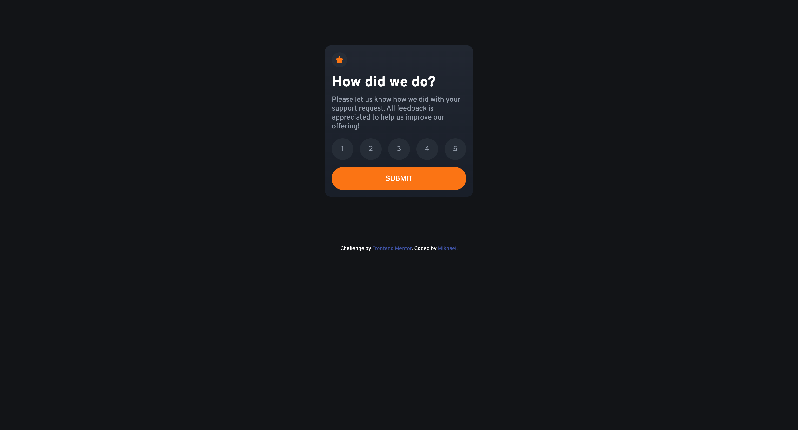

# Frontend Mentor - Profile card component solution

This is a solution to the [Profile card component challenge on Frontend Mentor](https://www.frontendmentor.io/challenges/profile-card-component-cfArpWshJ). Frontend Mentor challenges help you improve your coding skills by building realistic projects.

## Table of contents

- [Overview](#overview)
  - [The challenge](#the-challenge)
  - [Screenshot](#screenshot)
  - [Links](#links)
- [My process](#my-process)
  - [Built with](#built-with)
  - [What I learned](#what-i-learned)
  - [Continued development](#continued-development)
  - [Useful resources](#useful-resources)
- [Author](#author)
- [Acknowledgments](#acknowledgments)

## Overview

### The challenge

- Build out the project to the designs provided

### Screenshot



Add a screenshot of your solution. The easiest way to do this is to use Firefox to view your project, right-click the page and select "Take a Screenshot". You can choose either a full-height screenshot or a cropped one based on how long the page is. If it's very long, it might be best to crop it.

Alternatively, you can use a tool like [FireShot](https://getfireshot.com/) to take the screenshot. FireShot has a free option, so you don't need to purchase it.

Then crop/optimize/edit your image however you like, add it to your project, and update the file path in the image above.

### Links

- Solution URL: [Solution URL here](https://www.frontendmentor.io/solutions/profile-card-component-2_kk8iuvkM)
- Live Site URL: [Live site URL here](https://profile-card-component-mikhael7.vercel.app/)

## My process

### Built with

- Semantic HTML5 markup
- CSS custom properties
- Flexbox
- CSS Grid
- Mobile-first workflow

### What I learned

I use this for centering the profile picture, first i move the profile picture to center and then translate the Y axis to up, because i just move the image it create blank space in where the image is placed, so my solution to that just negate it with margin.

To see how you can add code snippets, see below:

```css
main>article.card>div.card-body>div.profile-image>img {
    transform: translateY(-4rem);
    margin-bottom: -4rem;
    border-radius: 100%;
    border: 0.25rem solid white;
}
```

If you want more help with writing markdown, we'd recommend checking out [The Markdown Guide](https://www.markdownguide.org/) to learn more.

### Continued development

I will try learning and mastering it with background images position, 'cause i struggling to get look like in design.

### Useful resources

- [Stackoverflow split background](https://stackoverflow.com/questions/42775063/how-to-split-background-color-into-two-using-css) - This is just one of example resource, trying to figure it out how to create the background bubble.
- [MDN background](https://developer.mozilla.org/en-US/docs/Web/CSS/background) - This is for MDN reference, of background css property.

## Author

- Frontend Mentor - [@mikhael7](https://www.frontendmentor.io/profile/@mikhael7)
- Github - [@mikhael7](https://github.com/mikhael7)

## Acknowledgments

This is where you can give a hat tip to anyone who helped you out on this project. Perhaps you worked in a team or got some inspiration from someone else's solution. This is the perfect place to give them some credit.
