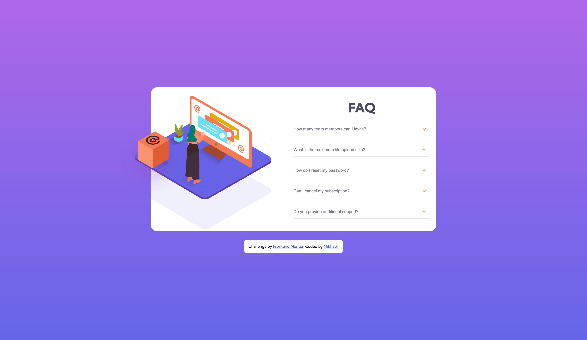

# Frontend Mentor - FAQ accordion card solution

This is a solution to the [FAQ accordion card challenge on Frontend Mentor](https://www.frontendmentor.io/challenges/faq-accordion-card-XlyjD0Oam). Frontend Mentor challenges help you improve your coding skills by building realistic projects.

## Table of contents

- [Overview](#overview)
  - [The challenge](#the-challenge)
  - [Screenshot](#screenshot)
  - [Links](#links)
- [My process](#my-process)
  - [Built with](#built-with)
  - [What I learned](#what-i-learned)
  - [Continued development](#continued-development)
  - [Useful resources](#useful-resources)
- [Author](#author)
- [Acknowledgments](#acknowledgments)

## Overview

### The challenge

Users should be able to:

- View the optimal layout for the component depending on their device's screen size
- See hover states for all interactive elements on the page
- Hide/Show the answer to a question when the question is clicked

### Screenshot



Add a screenshot of your solution. The easiest way to do this is to use Firefox to view your project, right-click the page and select "Take a Screenshot". You can choose either a full-height screenshot or a cropped one based on how long the page is. If it's very long, it might be best to crop it.

Alternatively, you can use a tool like [FireShot](https://getfireshot.com/) to take the screenshot. FireShot has a free option, so you don't need to purchase it.

Then crop/optimize/edit your image however you like, add it to your project, and update the file path in the image above.

### Links

- Solution URL: [Solution URL here](https://www.frontendmentor.io/solutions/faq-accordion-card-vXKSdqI0eB)
- Live Site URL: [Live site URL here](https://faq-accordion-card-mikhael7.vercel.app/)

## My process

### Built with

- Semantic HTML5 markup
- CSS custom properties
- Flexbox
- CSS Grid
- Mobile-first workflow

### What I learned

The picture element is a container which provides multiple sources to its contained image element to control which image resource to use, based on pixel density, viewport size, image format, and other factors. [More here (MDN)](https://developer.mozilla.org/docs/Web/HTML/Element/picture)

```html
<picture class="image-shadow">
  <source media="(min-width: 30em)" srcset="./images/bg-pattern-desktop.svg" />
  <source media="(max-width: 30em)" srcset="./images/bg-pattern-mobile.svg" />
  
</picture>
```

If you want more help with writing markdown, we'd recommend checking out [The Markdown Guide](https://www.markdownguide.org/) to learn more.

### Continued development

Use this section to outline areas that you want to continue focusing on in future projects. These could be concepts you're still not completely comfortable with or techniques you found useful that you want to refine and perfect.

The picture element i will use it for future reference and no more use srcset.

### Useful resources

- [Accordion reference (W3 Schools)](https://www.w3schools.com/howto/howto_js_accordion.asp) - This helped how to figure it out the approach will be taken on making the accordion.
- [Gradient reference (W3 Schools)](https://www.w3schools.com/css/css3_gradients.asp) - This helped me to make gradient background.
- [Picture Element reference (web.dev)](https://web.dev/learn/design/picture-element/) - This helped me to make picture element.
- [Flip Image reference (W3 Schools))](https://www.w3schools.com/howto/howto_css_flip_image.asp) - This helped me to flip the image.

## Author

- Frontend Mentor - [@mikhael7](https://www.frontendmentor.io/profile/@mikhael7)
- Github - [@mikhael7](https://github.com/mikhael7)

## Acknowledgments

This is where you can give a hat tip to anyone who helped you out on this project. Perhaps you worked in a team or got some inspiration from someone else's solution. This is the perfect place to give them some credit.
